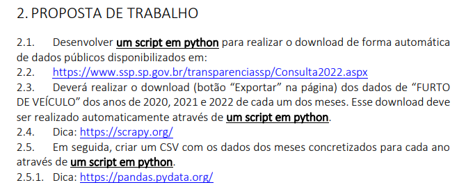

# Web Scraper dados de furtos de veículos
Web Scraper para automação do download de dados sobre furtos de veículos contidos no site da Segurança Pública de São Paulo.

<h3>Proposta e objetivos do projeto</h3>

Esse projeto foi desenvolvido através da proposta de Atividade Prática Supervisionada (APS) do segundo período de Ciência da Computação na UNIP.

O objetivo principal dessa APS é extrair dados sobre furtos de veículos do site da Segurança Pública do estado de São Paulo.
Através de bibliotecas que possibilitam o download dos arquivos e a 
manipulação de dados, o trabalho visa automatizar o processo manual de acessar o site e baixar os arquivos. O processo deve envolver a identificação da página que contém 
os dados e o download de diversas planilhas, seguido pela extração e organização 
dos dados relevantes em um formato unificado

A proposta da atividade é a seguinte:

